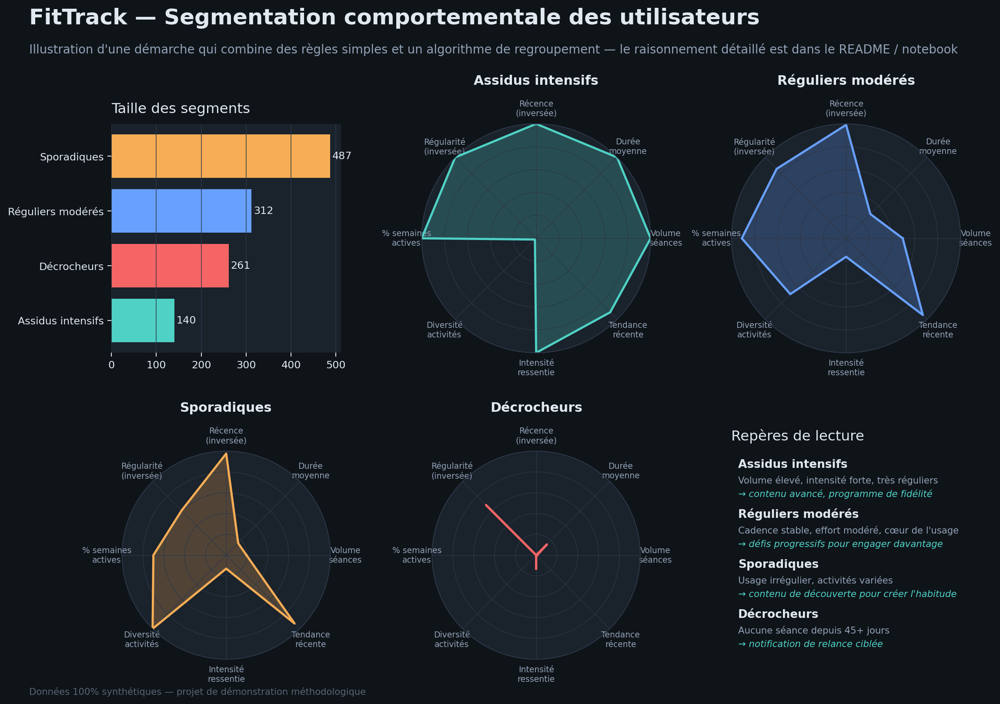

# 🏃 Segmentation comportementale des utilisateurs — FitTrack (projet démonstratif)

Un utilisateur sur cinq de FitTrack est en train de partir. Il n'a rien
désinstallé, il ne s'est désabonné de rien : il a simplement arrêté de faire
des séances. Et pour l'instant, personne dans l'équipe produit ne le sait,
parce que cette information n'existe nulle part sous une forme sur laquelle
on peut agir — elle est noyée dans un journal brut de séances, ligne par
ligne, pour chacun des utilisateurs.

C'est le problème que ce projet démonstratif essaie de résoudre : comment
transformer ce journal brut en profils d'utilisateurs qu'une équipe peut
comprendre et sur lesquels elle peut agir, avant qu'il ne soit trop tard.

## Pourquoi une équipe produit s'y intéresserait

Tous les utilisateurs ne se comportent pas pareil : certains reviennent très
régulièrement, d'autres arrêtent après quelques semaines, d'autres
pratiquent sans rythme fixe. Savoir "qui fait quoi" permet de :

- **repérer les utilisateurs sur le point de partir**, avant qu'ils ne
  décrochent complètement, pour tenter de les relancer,
- **adapter le contenu ou les messages** selon le profil (un utilisateur très
  assidu et un utilisateur occasionnel n'ont pas besoin des mêmes
  encouragements),
- **prioriser les efforts produit** : on ne traite pas de la même façon un
  segment de 300 utilisateurs très engagés et un segment de 50 utilisateurs
  qui reviennent une fois par mois.

Encore faut-il que ces profils soient compréhensibles et pas juste une
boîte noire statistique dont personne ne peut expliquer les frontières —
c'est le fil conducteur de tout ce qui suit.

## Ce que ça donne concrètement

| Segment | Ce qu'il représente | Action produit possible |
|---|---|---|
| **Assidus intensifs** | Usage très fréquent et intense | Contenu avancé, programme de fidélité, en faire des ambassadeurs |
| **Réguliers modérés** | Cœur de l'usage, cadence stable | Défis progressifs pour augmenter l'engagement |
| **Sporadiques** | Usage irrégulier, activités variées | Contenu de découverte pour transformer l'essai en habitude |
| **Décrocheurs** | Aucune séance depuis 45+ jours | Notification de relance ciblée, enquête de désengagement |

C'est ce dernier segment qui a ouvert ce document : dans ce jeu de données
(synthétique), un peu plus d'1 utilisateur sur 5 en fait partie. Sur un vrai
produit, c'est une population qu'on peut essayer de récupérer *avant*
qu'elle ne quitte l'application pour de bon, plutôt que de constater le
départ après coup dans les statistiques mensuelles. Reste à savoir comment
on construit ces segments sans tricher — c'est l'objet de la suite.

## La démarche

### 1. Les indicateurs : 4 grandes questions, pas une liste de métriques au hasard

Plutôt que d'utiliser toutes les métriques disponibles telles quelles
(nombre de séances, durée, type d'activité...), j'ai d'abord posé une
question simple : **qu'est-ce qui définit vraiment un comportement
d'usage ?** Réponse : 4 grandes questions, qui deviennent les 4 axes de la
segmentation :

- **Intensité** : cet utilisateur s'entraîne-t-il beaucoup, longtemps ?
- **Récence** : est-il encore actif aujourd'hui, ou a-t-il disparu ?
- **Régularité** : vient-il à un rythme stable, ou de façon imprévisible ?
- **Style d'usage** : varie-t-il ses activités, et son usage évolue-t-il ?

Chaque axe est mesuré par 1 à 3 indicateurs chiffrés (8 au total). Ce
cadrage évite un piège classique : si on utilise 10 métriques différentes
mais que 6 mesurent en réalité la même chose (l'intensité, par exemple),
l'algorithme va surtout regrouper les gens sur ce seul axe, en ignorant les
autres.

*Alternative envisagée et écartée* : le "score RFM", une méthode classique
en marketing qui résume un client à 3 nombres (depuis quand il n'a rien
acheté, combien de fois, combien il a dépensé). Simple à calculer, mais elle
ne dit rien sur la régularité (vient-il toutes les semaines, ou de façon
totalement imprévisible ?) ni sur la diversité des activités — deux
informations utiles pour distinguer, par exemple, un "touche-à-tout
sporadique" d'un "habitué qui répète toujours la même activité".

Restait à décider comment utiliser ces 8 indicateurs pour regrouper les
utilisateurs — et c'est là que les choses se compliquent.

### 2. La méthode : d'abord des règles simples, le clustering ensuite

On pourrait laisser un algorithme de clustering (une méthode qui regroupe
automatiquement les utilisateurs qui se ressemblent, sans qu'on lui dise
comment) trouver seul des groupes à partir des 8 indicateurs. Le problème :
les groupes obtenus seraient peut-être corrects sur le plan statistique,
mais personne ne pourrait expliquer simplement pourquoi tel utilisateur est
dans tel groupe plutôt qu'un autre — ce qui les rend difficiles à utiliser
en pratique par une équipe produit.

J'ai donc procédé en deux temps :

1. **Des règles simples et lisibles d'abord** : par exemple, "si un
   utilisateur n'a pas fait de séance depuis plus de 45 jours, il est classé
   décrocheur" — une règle que n'importe qui, technique ou non, peut
   vérifier lui-même.
2. **Un clustering (KMeans, un algorithme qui regroupe les utilisateurs les
   plus proches les uns des autres) ensuite, mais seulement à l'intérieur de
   chaque groupe de règle**, pour affiner les nuances (par exemple,
   distinguer parmi les utilisateurs réguliers ceux qui sont très intenses
   de ceux qui le sont modérément) — et seulement quand le groupe est assez
   grand pour que ce soit statistiquement fiable.

*Compromis assumé* : cette méthode est un peu moins "optimale"
mathématiquement qu'un clustering unique sur tout le monde en même temps.
Mais chaque segment reste rattaché à une règle qu'on peut expliquer en une
phrase — et en pratique, c'est souvent ce qui décide si une segmentation est
vraiment utilisée par une équipe produit, ou si elle finit oubliée dans un
rapport.

Restait un problème pratique avant de pouvoir comparer qui que ce soit
équitablement.

### 3. Nettoyer les données avant de les comparer

Certains indicateurs (le nombre de séances, par exemple) ont une
distribution très étalée : quelques utilisateurs très actifs peuvent avoir
5 à 10 fois plus de séances que la médiane. Sans précaution, ces quelques
cas extrêmes "tirent" l'algorithme et faussent les comparaisons entre tout
le monde. Pour corriger ça :
- une transformation mathématique (`log1p`) "tasse" les grandes valeurs pour
  rendre la distribution plus régulière,
- une mise à l'échelle robuste aux valeurs extrêmes (`RobustScaler`, basée
  sur la médiane plutôt que la moyenne) est utilisée à la place d'une mise
  à l'échelle classique, plus sensible aux cas extrêmes.

Restait la question la plus inconfortable, celle que beaucoup d'analyses de
segmentation évitent : comment savoir si tout ça fonctionne vraiment ?

### 4. Vérifier que la méthode n'invente pas des groupes au hasard

C'est le point le plus important de la démarche. En situation réelle, on n'a
jamais de "bonne réponse" officielle à laquelle comparer le résultat d'un
clustering — impossible de savoir si les groupes trouvés reflètent un vrai
comportement ou un hasard statistique, sauf à se donner un moyen de
vérifier.

Ici, la solution a été de générer les données à partir de profils-types
cachés (jamais communiqués à l'algorithme), pour ensuite comparer, une fois
la segmentation terminée, si elle retrouve bien ces profils. Une bonne
correspondance confirme que la méthode fonctionne — sans garantir qu'elle se
comporterait aussi bien sur de vraies données, où les frontières entre
profils sont sûrement moins nettes (voir Limites).

## Compétences démontrées

| Compétence | Où elle se manifeste |
|---|---|
| **Cadrage métier avant la technique** | 8 indicateurs construits autour de 4 questions métier, définies avant tout choix d'algorithme |
| **Prétraitement adapté à la distribution des données** | Correction des valeurs extrêmes justifiée par la forme réelle des données, pas un choix par défaut |
| **Conception d'une méthode hybride pour l'explicabilité** | Règles métier puis clustering local, plutôt qu'un clustering pur illisible pour une équipe métier |
| **Esprit critique sur les paramètres du modèle** | Seuils choisis consciemment, limites documentées plutôt que cachées |
| **Protocole de validation sans vérité terrain** | Profils générateurs cachés, comparés a posteriori au résultat |
| **Communication à une audience non technique** | Dashboard et libellés de segments pensés pour une équipe produit, pas pour d'autres data scientists |

## Résultats (illustratifs)

*Ces résultats illustrent que la démarche ci-dessus produit des segments
cohérents — ils ne sont pas la finalité du projet.*



| Segment | Volume | Régularité | Description |
|---|---|---|---|
| Assidus intensifs | Élevé | Forte | Séances fréquentes, intenses, très réguliers |
| Réguliers modérés | Moyen | Forte | Cœur de l'usage, cadence stable |
| Sporadiques | Variable | Faible | Usage irrégulier, activités variées |
| Décrocheurs | — | — | Aucune séance depuis 45+ jours |

## Structure du repo

```
├── data/                          # Données synthétiques générées
├── notebooks/
│   └── segmentation_fittrack.ipynb   # Notebook principal (orchestration + raisonnement détaillé)
├── src/
│   ├── config.py                     # Constantes partagées (chemins, fenêtre temporelle, indicateurs)
│   ├── generate_synthetic_data.py    # Génération du jeu de données
│   ├── build_indicators.py           # Calcul des 8 indicateurs
│   ├── segment_users.py              # Segmentation règles + clustering
│   └── make_dashboard.py             # Génération du visuel de synthèse
└── outputs/
    └── dashboard_segmentation.png
```

## Reproduire le projet

```bash
pip install pandas numpy scikit-learn matplotlib
python src/generate_synthetic_data.py
python src/build_indicators.py
python src/segment_users.py
python src/make_dashboard.py
```

Ou directement le notebook `notebooks/segmentation_fittrack.ipynb`, qui
détaille le raisonnement à chaque étape (pas seulement le code).

## Limites

- Le nombre de sous-groupes par règle (2) est fixé arbitrairement ; une
  méthode statistique existante (le score de silhouette, qui mesure la
  qualité d'un regroupement) permettrait de le déterminer plus
  rigoureusement plutôt qu'à l'instinct.
- Les seuils des règles métier (45 jours, etc.) sont des choix simples, à
  calibrer avec une équipe produit sur des données réelles.
- Aucune analyse de stabilité temporelle des segments (un utilisateur
  change-t-il souvent de segment d'un mois à l'autre ?) n'est faite ici.
- La validation par profils générateurs prouve que la méthode retrouve une
  structure connue *sur des données calquées sur cette structure* — ce
  n'est pas une preuve de généralisation à un usage réel, où les frontières
  entre profils sont plus floues.

Ce qui reste, une fois ces réserves posées : un problème business
concret — des utilisateurs qui partent sans bruit —, traduit en indicateurs
justifiés, une méthode assumée, et une validation qui ne triche pas. Pour
FitTrack, ça veut dire une chose simple : savoir qui est en train de partir
avant qu'il ne soit trop tard, plutôt que de le découvrir dans un rapport le
mois suivant.

---
*Toutes les données de ce projet sont 100% synthétiques. Il s'agit d'un projet
de démonstration méthodologique, ne reflétant aucune donnée réelle d'un
employeur ou d'un tiers.*
